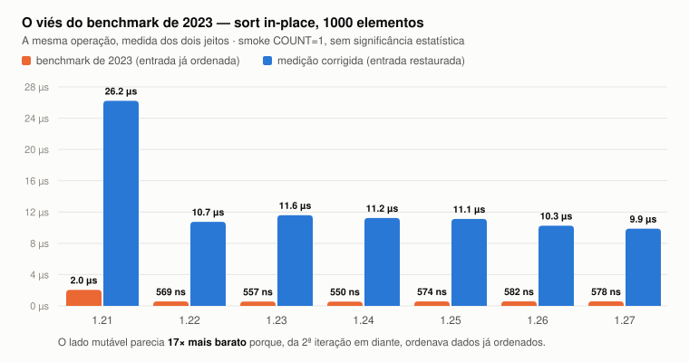
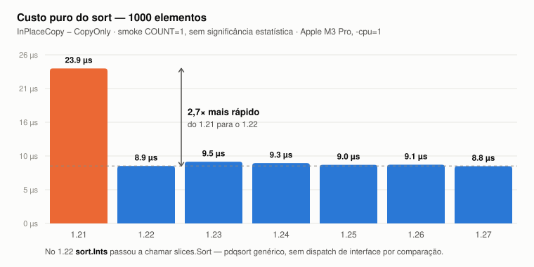

# Achados preliminares — rodada smoke

> ⚠️ **Estes números são de uma rodada smoke: `COUNT=1`, `BENCHTIME=50ms`.**
> Uma amostra por ponto significa **zero significância estatística** — o
> `benchstat` imprime `± ∞` e recusa comparar. Servem para dizer *o que
> procurar* na rodada boa (`COUNT=10 BENCHTIME=1s`), não para ir ao slide.
>
> Máquina: Apple M3 Pro, macOS, `-cpu=1`. Registro completo em
> [`environment.txt`](environment.txt).

O que muda com a rodada boa: as barras acima de ~1 µs devem se manter (as
diferenças são grandes demais para serem ruído), e o custo da alocação —
achado 5, abaixo — é o único que hoje está **abaixo do ruído** e pode virar
qualquer coisa.

---

## 1. O viés do benchmark de 2023, isolado



A mesma operação — ordenar 1000 inteiros in-place — medida dos dois jeitos, em
cada versão. O benchmark de 2023 sistematicamente reporta **~17× menos** do que
custa de verdade, porque a partir da segunda iteração ele ordena dados **já
ordenados**, e o pdqsort detecta sequência ordenada e sai quase de graça.

O controle que fecha o argumento:

| Go 1.27.1 | benchmark 2023 | corrigido | razão |
|---|---:|---:|---:|
| `InPlace/1k` (mutável) | 578 ns | 9 874 ns | **17,1×** |
| `Immutable/1k` (imutável) | 9 178 ns | 9 378 ns | 1,02× |

**O lado imutável não muda.** Ele nunca foi enviesado — não tinha como ser,
porque nunca escreve na entrada. Todo o erro está do lado cuja assinatura
`func SortInPlace(s []int)` não avisava nada.

> Não foi descuido de medição. Foi **não-localidade**: o erro estava na
> assinatura, não no laço.

---

## 2. O sintoma esperado NÃO se reproduziu — e isso é resultado

A hipótese era encontrar `ns/op` quase idêntico entre n=5 e n=1000 no
`LegacyInPlace`, como nos slides de 2023. **Não é o que acontece:**

| benchmark (Go 1.27.1) | n=5 | n=1k | razão |
|---|---:|---:|---:|
| `LegacyInPlace` (enviesado) | 6,01 ns | 578,3 ns | **96×** |
| `InPlace` (corrigido) | 37,67 ns | 9 874 ns | 262× |

O viés **não achata** a curva: ele a torna **linear**. Ordenar dados já
ordenados é O(n) no pdqsort, não O(n log n) — então a curva enviesada continua
crescendo com o tamanho, só que mais devagar. Noventa e seis vezes não é "quase
idêntico".

**Consequência:** o `ns/op` plano dos slides de 2023 **não é explicado por este
erro**. A hipótese alternativa fica mais forte — a de que os quatro slides
mostram o mesmo caso com o rótulo trocado, dado o `-bench=. -bench=Sort5`
duplicado no comando. São **dois erros distintos**, não um.

---

## 3. O sort ficou 2,7× mais rápido do 1.21 para o 1.22



O salto está exatamente na release em que `sort.Ints` passou a chamar
`slices.Sort` — pdqsort genérico, sem dispatch de interface por comparação. Do
1.22 em diante a curva é plana: **a melhora foi um degrau, não uma tendência.**

| versão | custo puro do sort, n=1k |
|---|---:|
| 1.21 | 23 901 ns |
| 1.22 | 8 859 ns |
| 1.23 | 9 514 ns |
| 1.24 | 9 299 ns |
| 1.25 | 9 038 ns |
| 1.26 | 9 055 ns |
| 1.27 | 8 822 ns |

O benchmark de 2023 mediu um sort **2,7× mais lento** que o de hoje. E a
melhoria veio de **generics na stdlib** — a mesma mudança que a palestra trata
como "o Go andando na direção do paradigma" tornou o caminho *mutável* mais
rápido também.

---

## 4. Em 1.21, o caminho "mutável" alocava

| Go | `InPlace/5` | `InPlace/1k` |
|---|---|---|
| 1.21 | **24 B/op, 1 alloc** | **24 B/op, 1 alloc** |
| 1.22 → 1.27 | 0 B/op, 0 allocs | 0 B/op, 0 allocs |

No 1.21, `sort.Ints(x)` passava por `sort.Sort(IntSlice(x))`, e a conversão
para a interface escapava para o heap. Vinte e quatro bytes é exatamente o
cabeçalho de slice boxado.

O contraste "mutável não aloca, imutável aloca" de 2023 era, em parte, **falso**
— e note que a alocação é constante, não cresce com n: é a interface, não os
dados.

---

## 5. Custo da alocação: abaixo do ruído, fica para a rodada boa

`Immutable − InPlaceCopy` isola o preço do allocator + GC. Com `count=1`:

| versão | 1.21 | 1.22 | 1.23 | 1.24 | 1.25 | 1.26 | 1.27 |
|---|---:|---:|---:|---:|---:|---:|---:|
| ns | 588 | 594 | 431 | 459 | 440 | **672** | 459 |

A oscilação (431 → 672 → 459) é maior que qualquer efeito plausível, e o 1.26 —
justamente a release do Green Tea GC — aparece como o **pior**. Isso é ruído de
amostra única, não resultado. **É o número que a rodada com `COUNT=10` existe
para responder.**

---

## Descoberta lateral: `StopTimer` para o mundo

Tentando quantificar o overhead do `b.StopTimer()`/`b.StartTimer()` que corrige
o viés, dois achados sobre o próprio instrumento:

1. **Um benchmark cujo corpo é só o par não termina.** O tempo *cronometrado*
   por iteração é ~zero — o cronômetro está parado justamente durante o que se
   quer medir — então o framework sobe `b.N` perseguindo o `-benchtime` e o
   relógio de parede explode. Travou duas vezes até o diagnóstico.

2. **O par é stop-the-world.** Em `$GOROOT/src/testing/benchmark.go`:

   ```go
   func (b *B) StopTimer() {
       b.duration += highPrecisionTimeSince(b.start)
       runtime.ReadMemStats(&memStats)   // ← STW, e fora da conta
   ```

   `StartTimer` faz o mesmo antes de reabrir o cronômetro. Cada par para o
   mundo duas vezes, e esse custo fica **fora** do `ns/op`.

O resíduo que *entra* na conta, medido de forma diferencial
(`BenchmarkTimerPair`): **305 ns (1.27)**, **400 ns (1.21)**. Para n=5, onde o
sort inteiro custa ~10 ns, isso é o que torna o número inútil — daí a via
alternativa `InPlaceCopy − CopyOnly`, que não toca no cronômetro.

**A ironia que vale o slide:** a correção do erro de 2023 introduz um
instrumento que para o mundo. Medir é caro, e medir *bem* é mais caro ainda.

---

## Como reproduzir

```bash
cd benchmarks/crossversion
./run.sh install                          # uma vez
COUNT=1 BENCHTIME=50ms ./run.sh run       # esta rodada, ~5 min
./run.sh compare
```

A rodada boa — máquina ociosa, na tomada, sem Docker:

```bash
./run.sh all                              # COUNT=10 BENCHTIME=1s, dezenas de minutos
```
